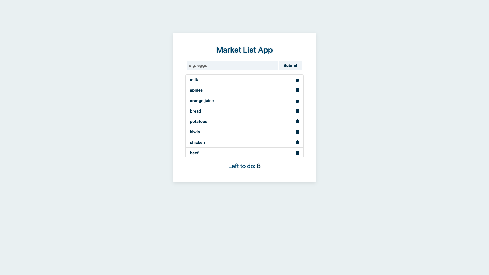
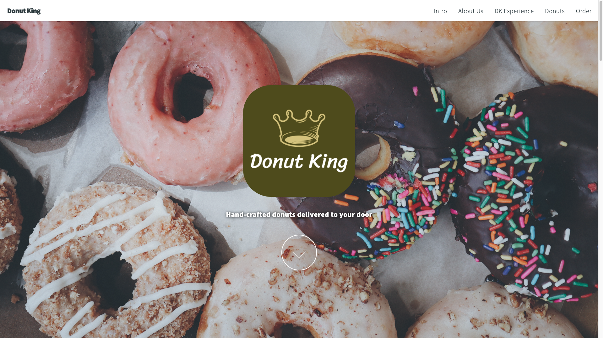
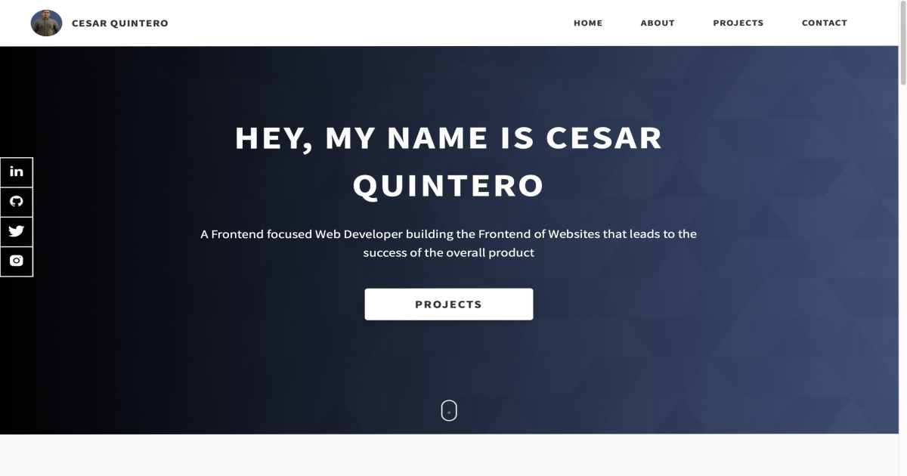

# Portfolio Website : <a target="_blank" href="https://market-list-grocery-app.herokuapp.com/">Visit Here</a>

### A full-stack CRUD web app to create and manage your grocery shopping list.

## Tech used: 

My learning was focused on using CRUD methods when setting up the server and creating a seemless connection between the database and Heroku.

## Optimizations

My next steps for improving this project would be to set up user authentication, organizing the backend using the MVC architectural pattern, using ID's on objects returning from MongoDB for managing duplicates, and adding React for better component-based structure on the front-end.

## Lessons Learned:

Utilizing best practices to setup the the code on the server to prevent potential problems during deployment. Using Express methods allowed for better code readability.

## More Projects

<table bordercolor="#66b2b2">
  
  <tr>
    <td width="33.3%"  style="align:center;" valign="top">
<a target="_blank" href="https://github.com/Cesar-Quintero/Coiffeur">Coiffeur</a>
         
      
    </td>
    <td width="33.3%" valign="top">
<a target="_blank" href="https://github.com/Cesar-Quintero/donut-king">Donut King</a>
       
        
    </td>
    <td width="33.3%" valign="top">
<a target="_blank" href="https://github.com/Cesar-Quintero/Cesar-Quintero-Portfolio-Website">Portfolio Website</a>
         
      
    </td>
  </tr>
</table>